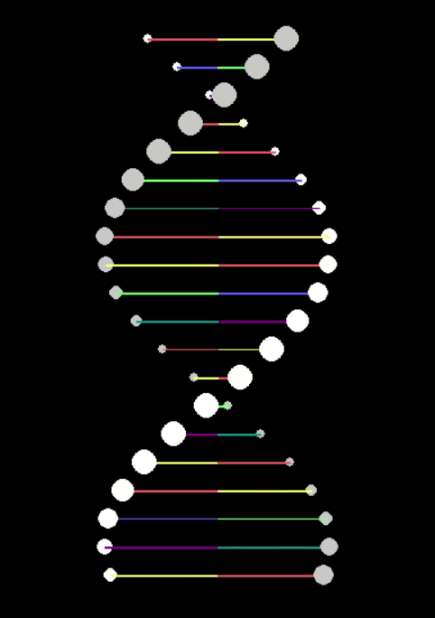

# Pygame DNA Helix Animation

A simple 2.5D animation of a rotating DNA double helix, created using Python and the Pygame library. This project demonstrates basic animation principles, coordinate transformation for a helix, and Z-sorting for a pseudo-3D effect.

## Preview



## Features

*   **Rotating Double Helix:** Visual representation of the DNA structure.
*   **Color-Coded Base Pairs:** Simplified representation of base pairs with distinct colors.
*   **Depth Illusion (2.5D):**
    *   Backbone "atoms" (dots) change size based on their Z-depth.
    *   Elements are Z-sorted, so closer elements are drawn on top of farther ones.
*   **Configurable Parameters:** Easily adjust helix radius, number of pairs, rotation speed, colors, etc., via constants in the script.

## Requirements

*   Python 3.6+
*   Pygame library

## Installation

1.  **Clone the repository (or download the script):**
    ```bash
    git clone https://github.com/YOUR_USERNAME/YOUR_REPOSITORY_NAME.git
    cd YOUR_REPOSITORY_NAME
    ```

2.  **Install Pygame:**
    If you don't have Pygame installed, you can install it using pip:
    ```bash
    pip install pygame
    ```
    Or, if you use `pip3`:
    ```bash
    pip3 install pygame
    ```

## How to Run

Navigate to the directory containing the script (`dna_animation.py` or whatever you named it) and run it from your terminal:

```bash
python dna.py
